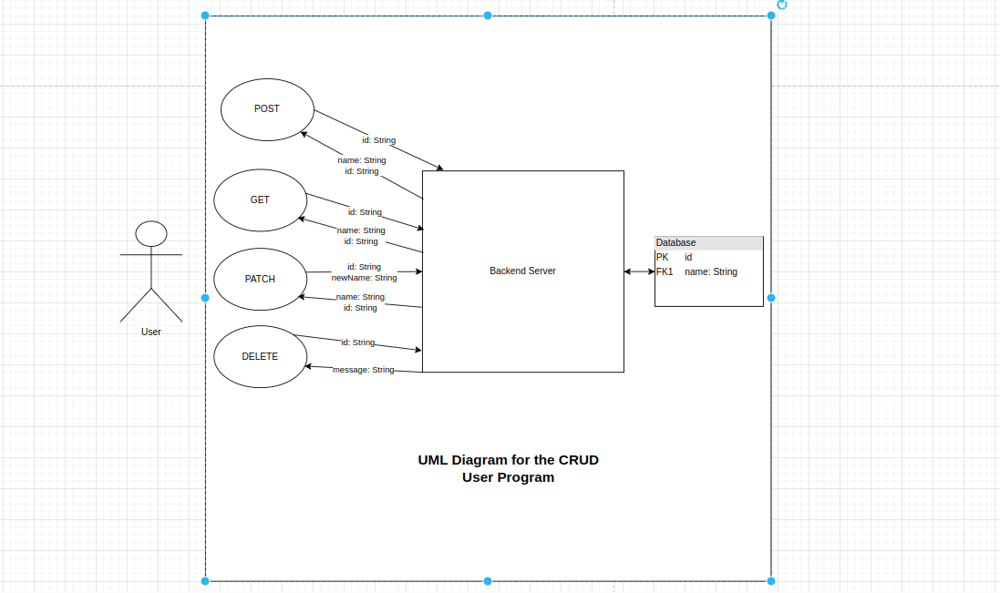

# CRUD User

### Everything you need to know

By Francis Onukwu

---



This is a backend project built using TypeScript for a NodeJS server and a MongoDb powered database. To get this running on your machine, you must first download and install [NodeJs](https://nodejs.org/en/download), clone this repository by running
`git clone https://github.com/onfranciis/hngx-stage2`, navigate to the `hngx-stage2` folder in your terminal and running `npm install`. Once all the dependencies have been installed you should create a `.env` file and fill it with these details

```
PORT = "1234"
DEV_DB_URL = <A valid MongoDb Url>
ENVIRONMENT = "development"
```

You can get a free MongoDb Url from [Atlas](https://www.mongodb.com/atlas/database). Now in your terminal, run `npm run serve` and if successfull, you should see `... development server has started on port 1234`. Now head over to `http://localhost:1234` on your browser and if everything is successfull, you should see this

```
{
  connected:true
}
```

<br>

The API documentation can be found [here](./DOCUMENTATION.md)
